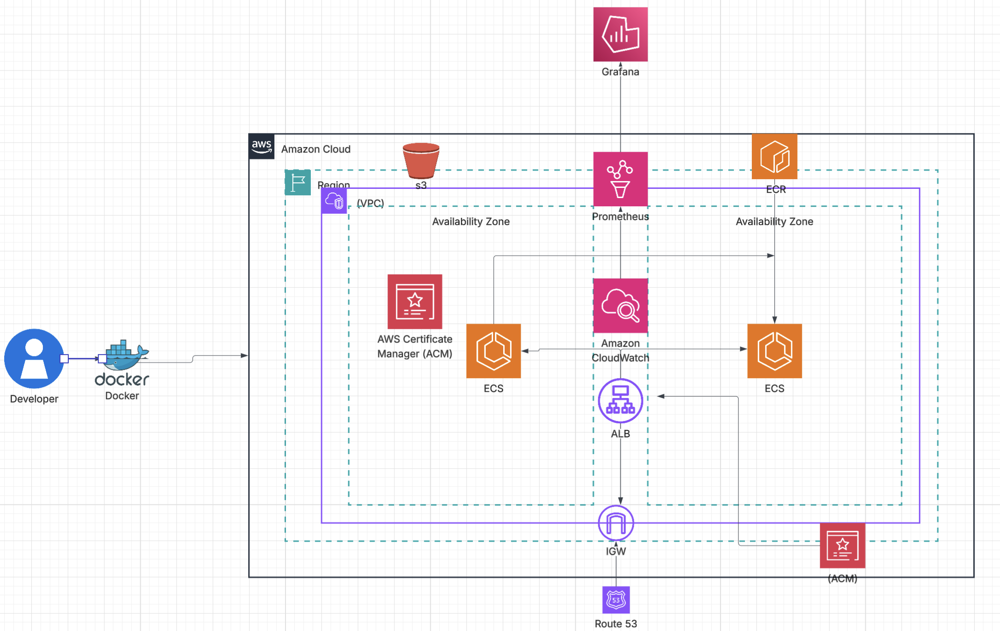
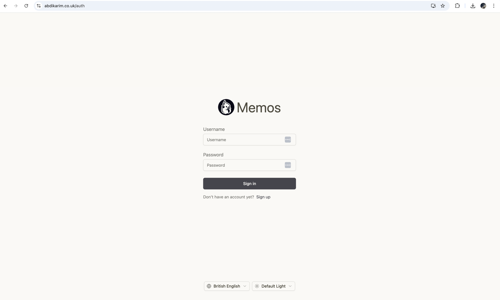
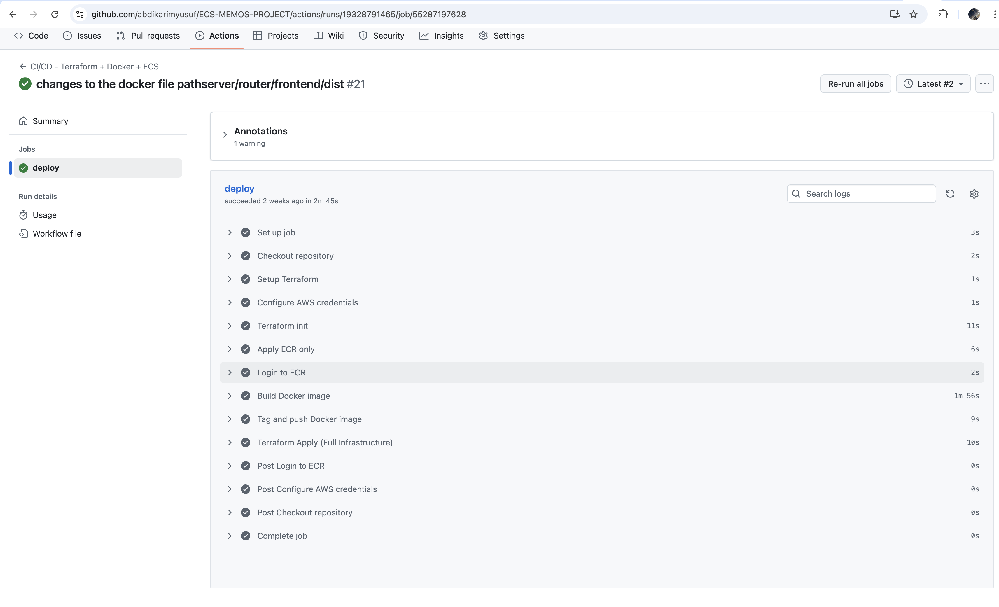

# Memos on AWS ECS Fargate

Production-grade deployment of **Memos**, an open-source and privacy-focused note-taking platform, using AWS cloud services, Infrastructure as Code, and CI/CD automation.

---

## 📌 Overview

This project deploys **Memos** into AWS as a secure, scalable, and highly-available platform using modern DevOps practices.

The application follows a **three-tier architecture**:

- Presentation Tier (ALB + HTTPS)
- Application Tier (ECS Fargate)
- Data Tier (Amazon RDS PostgreSQL)

Everything is provisioned using **Terraform** and deployed via **GitHub Actions CI/CD pipeline**.

---

## 🖼️ Architecture & Flow

### System Architecture


### Application Interface


### CI/CD Pipeline


---

## 🏗️ Architecture Overview

### Presentation Tier
- Route 53 (DNS routing)
- AWS ACM (TLS certificates)
- Application Load Balancer (ALB)

### Application Tier
- ECS Fargate
- Docker containers
- Internal-only networking (no public IPs)
- Horizontally scalable

### Data Tier
- Amazon RDS (PostgreSQL)
- Deployed in private subnets
- Credentials stored in AWS Secrets Manager

---

## ⚙️ Technology Stack

| Category | Tool |
|----------|------|
| Containerization | Docker |
| Infrastructure | Terraform |
| Orchestration | AWS ECS Fargate |
| Database | Amazon RDS (PostgreSQL) |
| Container Registry | Amazon ECR |
| CI/CD | GitHub Actions |
| Monitoring | CloudWatch |
| Secrets | AWS Secrets Manager |
| Networking | VPC, Route 53 |
| Security | ACM, Security Groups |
| Traffic | Application Load Balancer |

---

## 🚀 CI/CD Pipeline

The pipeline is fully automated using GitHub Actions.

### Workflow
1. Code push to GitHub
2. Docker build
3. Image vulnerability scan (Trivy)
4. Push to ECR
5. Terraform plan
6. Terraform apply
7. ECS service update
8. Rolling deployment

Pipeline definition:

.github/workflows/ci-cd.yml

yaml
Copy code

---

## 📁 Repository Structure

```text

ECS-MEMOS-PROJECT/
├── README.md
├── app/
│   └── memos/
├── docker/
│   └── Dockerfile
├── terraform/
│   ├── main.tf
│   ├── output.tf
│   ├── provider.tf
│   ├── terraform.tfvars
│   ├── variables.tf
│   └── modules/
│       ├── acm/
│       ├── alb/
│       ├── ecr/
│       ├── ecs/
│       ├── ecs_service/
│       ├── ecs_task/
│       ├── iam/
│       ├── logs/
│       ├── route53/
│       ├── security/
│       └── vpc/
├── images/
│   ├── application.png
│   ├── diagram.png
│   └── pipeline.png
└── .github/
    └── workflows/
        └── ci-cd.yml
...


---

## 🌐 Networking Design

- Custom VPC
- Public subnets → ALB
- Private subnets → ECS + RDS
- NAT Gateway for outbound traffic
- Security Groups restrict access

---

## 🛡️ Security Design

| Feature | Enabled |
|--------|---------|
| HTTPS encryption | ✅ |
| Private subnets | ✅ |
| IAM least privilege | ✅ |
| Secrets Manager | ✅ |
| Network isolation | ✅ |
| CloudWatch logging | ✅ |
| Image scanning | ✅ |

---

## 📊 Observability

### Logging
- CloudWatch Logs
- Centralized log groups
- Container-level logging

### Monitoring
- ALB health checks
- ECS service health
- CloudWatch metrics

---

## 🐳 Run Locally

Run Memos locally using Docker:

```bash
docker run -d \
  -p 5230:5230 \
  -v ~/.memos:/var/opt/memos \
  neosmemo/memos:stable
Open:

arduino
Copy code
http://localhost:5230
Production URL:

arduino
Copy code
https://memos.yourdomain.com
🏆 Why This Setup?
✅ Production-grade cloud deployment

✅ Infrastructure as Code

✅ Secure by design

✅ CI/CD automation

✅ Highly available

✅ Horizontally scalable

✅ Real-world DevOps architecture

🔮 Future Enhancements
Auto scaling

Blue/green deployments

Database backups & restore

RDS read replicas

WAF protection

Cost monitoring

Disaster recovery planning

👨‍💻 Author
Built by: Abdikarim Yusuf
Role: Cloud / DevOps Engineer