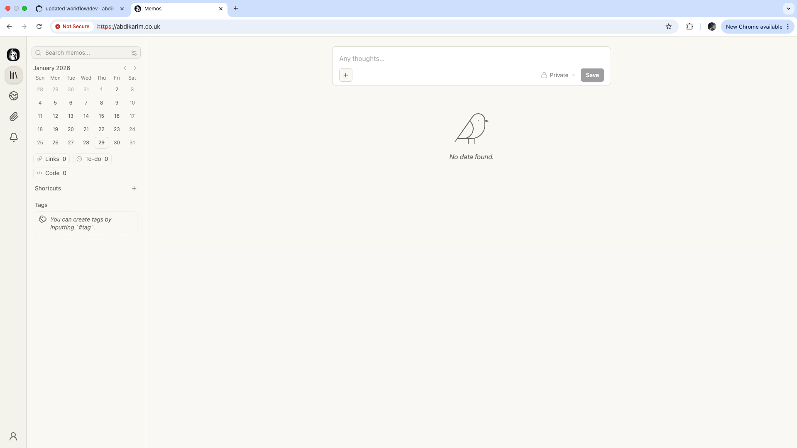
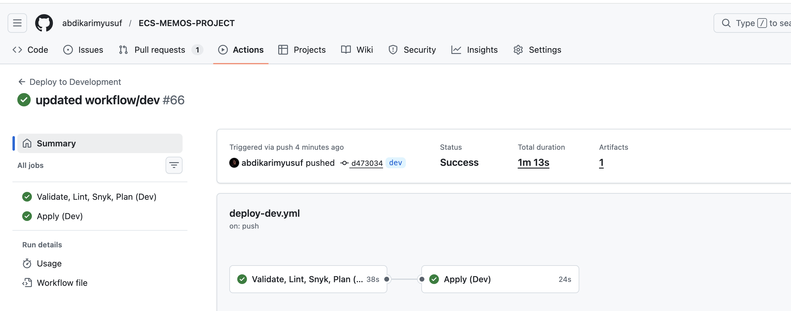
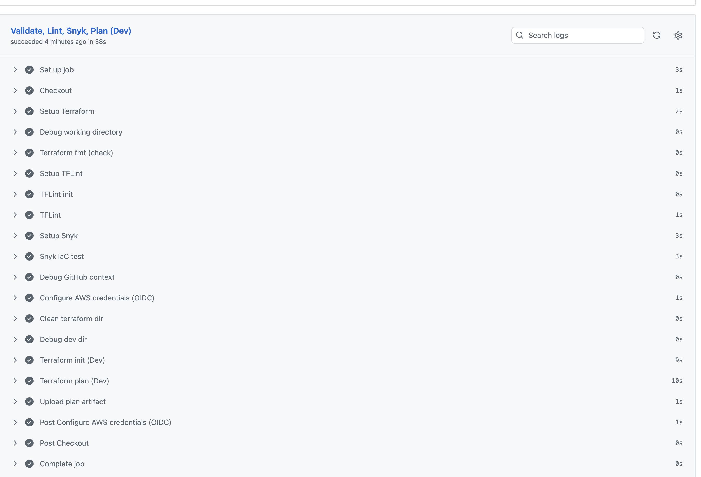
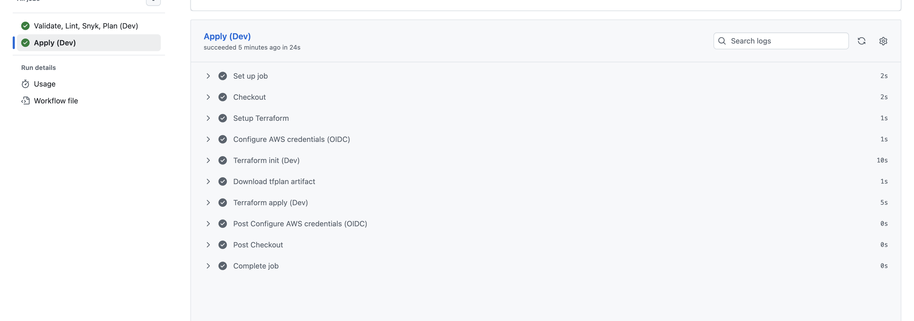
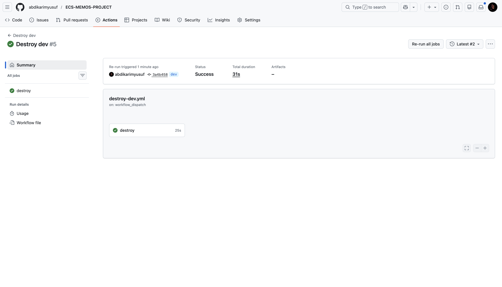

# Memos on AWS ECS Fargate

Production-grade deployment of **Memos**, an open-source and privacy-focused note-taking platform, using AWS cloud services, Infrastructure as Code, and CI/CD automation.

---

##  Overview

This project deploys **Memos** into AWS as a secure, scalable, and highly-available platform using modern DevOps practices.

The application follows a **three-tier architecture**:

- Presentation Tier (ALB + HTTPS)
- Application Tier (ECS Fargate)
- Data Tier (Amazon RDS PostgreSQL)

Everything is provisioned using **Terraform** and deployed via **GitHub Actions CI/CD pipeline**.

---

##  Architecture & Flow

### System Architecture


## Components

### Network

- **VPC:** `10.0.0.0/16` spanning 2 Availability Zones
- **Public Subnets (2):**
  - Application Load Balancer (ALB)
  - ECS tasks
- **Private Subnets (2):**
  - Amazon RDS
- **Internet Gateway**
- **NAT Gateway**

---

### Compute

- **Amazon ECS (Fargate)**
  - 2 running tasks
  - Auto-scaling enabled
- **Docker Images**
  - Stored in **Amazon ECR**

---

### Application Interface



### Database

- **Amazon RDS (PostgreSQL 17.6)**
  - Multi-AZ deployment
  - Automated backups
  - Deployed in private subnets

---

### Security

- **Security Groups**
  - ALB → ECS
  - ECS → RDS
- **IAM Roles**
  - Least-privilege access
- **AWS Secrets Manager**
  - Secure storage for sensitive configuration
- **Encryption**
  - SSL/TLS for data in transit

---

### CI/CD Pipeline





---


### DNS & SSL

- **Amazon Route 53**
  - DNS management
- **AWS Certificate Manager (ACM)**
  - SSL/TLS certificates
  - Automatic DNS-based validation

---

### Docker Images

- Backend Docker image
- Frontend Docker image
- Images pushed to **Amazon ECR**

---
## Local Development

### Docker Compose (Local Testing)

- **Docker Compose** is used for local development
- **Nginx** acts as a reverse proxy

#### Traffic Routing
- `/api` → Backend service
- `/` → Frontend service

This setup mirrors the production traffic flow.


---

##  CI/CD Pipeline

The pipeline is fully automated using GitHub Actions.

### Workflow
1. Code push to GitHub
2. Docker build
3. Image vulnerability scan (Trivy)
4. Push to ECR
5. Terraform plan
6. Terraform apply
7. ECS service update
8. Rolling deployment

Pipeline definition:

.github/workflows/ci-cd.yml

yaml
Copy code

---

##  Repository Structure

```text

ECS-MEMOS-PROJECT/
├── README.md
├── app/
│   └── memos/                     # Application source code
├── docker/
│   └── Dockerfile                 # Container image definition
├── terraform/
│   ├── envs/
│   │   ├── dev/                   # Dev environment Terraform config
│   │   │   ├── backend.tf
│   │   │   ├── backend.hcl
│   │   │   ├── main.tf
│   │   │   ├── provider.tf
│   │   │   ├── variables.tf
│   │   │   ├── terraform.tfvars
│   │   │   └── output.tf
│   │   ├── staging/               # Staging environment Terraform config
│   │   │   ├── backend.tf
│   │   │   ├── main.tf
│   │   │   ├── variables.tf
│   │   │   ├── terraform.tfvars
│   │   │   └── output.tf
│   │   └── prod/                  # Production environment Terraform config
│   │       ├── backend.tf
│   │       ├── main.tf
│   │       ├── variables.tf
│   │       ├── terraform.tfvars
│   │       └── output.tf
│   └── modules/                   # Reusable Terraform modules
│       ├── acm/
│       ├── alb/
│       ├── ecr/
│       ├── ecs/
│       ├── iam/
│       ├── logs/
│       ├── rds/
│       ├── route53/
│       ├── security/
│       └── vpc/
├── images/
│   ├── application.png            # App architecture diagram
│   ├── diagram.png                # Infrastructure diagram
│   └── pipeline.png               # CI/CD pipeline overview
└── .github/
    └── workflows/
...


---

## Troubleshooting

### Tasks Not Starting

- Check **CloudWatch Logs**
  - `/ecs/memos`
- Verify secrets in **AWS Secrets Manager**
- Check **security group rules*

---

##  Observability

### Logging
- CloudWatch Logs
- Centralized log groups
- Container-level logging

### Monitoring
- ALB health checks
- ECS service health
- CloudWatch metrics

---
### Certificate Not Validating

- Verify DNS validation records in **Route 53**
- Wait up to **30 minutes**
- Confirm domain ownership

---

### Targets Unhealthy

- Verify **ALB health check** configuration
  - Accepted status codes: `200`, `307`
- Confirm **ALB → ECS** security group access
- Check application logs

---


## 🐳 Run Locally

Run Memos locally using Docker:

```bash
docker run -d \
  -p 5230:5230 \
  -v ~/.memos:/var/opt/memos \
  neosmemo/memos:stable
Open:

arduino
Copy code
http://localhost:5230
Production URL:


👨‍💻 Author
Built by: Abdikarim Yusuf
Role: Cloud / DevOps Engineer
